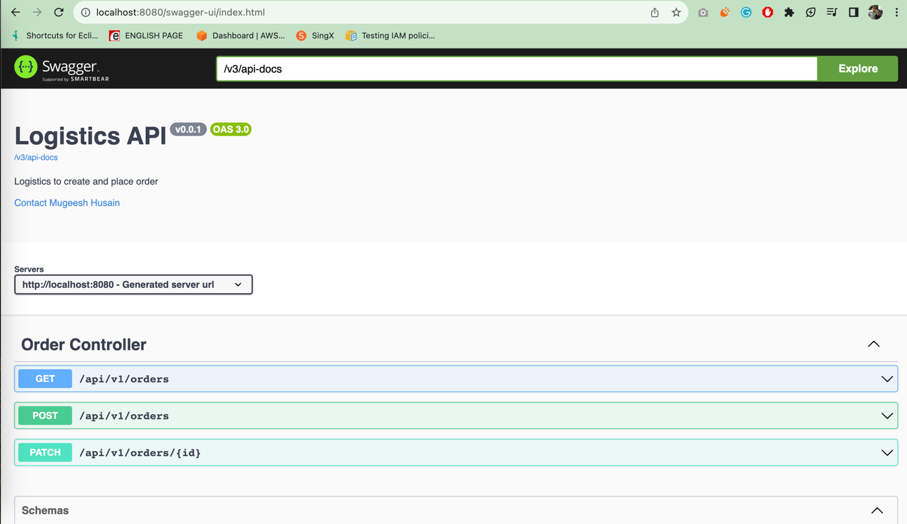

# logistics API
###### Description:
I have used these technologies to create Rest API.
* JAVA 17
* SpringBoot 3.1.3
* Mysql:8.1.0 for DB
* Maven for build
* Docker

### How to Run
* open application.yml file
  * Change **REPLACE_MAP_KEY** to you actual key.
  * then
* ```` sh start.sh ````
* Application Started...
* then open your browser use this link
* http://localhost:8080/swagger-ui/index.html
#### OR
* use Postman/RestClient
* **Create order**
  * http://localhost:8080/api/v1/orders
````
response body :
{
    "origin": ["22.300574", "114.174732"],
    "destination": ["22.3129446", "114.2149788"]
}
````
* **Place order**
    * http://localhost:8080/api/v1/orders/6
````
response body : {"status": "TAKEN"}
````
* **Get All order by Page**
    * http://localhost:8080/api/v1/orders?page=1&limit=10

### Swagger UI



### Integration Test
* To run the integration test, you must need java17 in your machine
* then run this command
````
 ./mvnw test -Ptest
  response:
  Tests run: 8, Failures: 0, Errors: 0, Skipped: 0
````
OR 
#### Integration along with sh start.sh 
* In my code, I am using mysql test container for running integration test.
* Running integration its depends upon which machine we used.(I don't know which machine you gonna use)
* I cannot write common command which run windows or mac or linux,(these also have more version like Apple M1,M2, Intel, Ubuntu,Windows version's)
* Need separate command with different environment.  
````
Run with Apple M1 PC
* In Dockerfile please change these changes. 
chnage RUN mvn clean package instead of RUN mvn clean package -DskipTests
* uncomment these line
* #ENV DOCKER_HOST=tcp://host.docker.internal:2375
* #ENV TESTCONTAINERS_HOST_OVERRIDE=host.docker.internal
in terminal run this command
# docker run -p 2375:2375 -v /var/run/docker.sock://var/run/docker.sock alpine/socat tcp-listen:2375,reuseaddr,fork unix-connect:/var/run/docker.sock
then
sh start.sh
then it would build with intergration test
````
